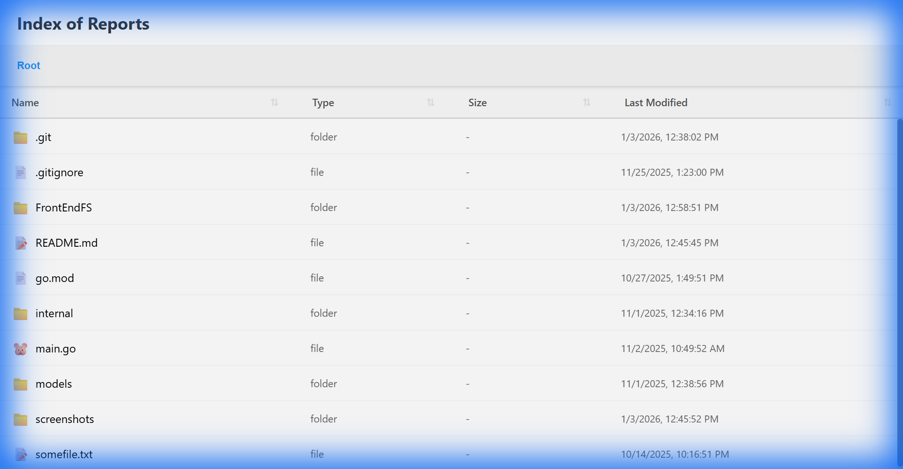
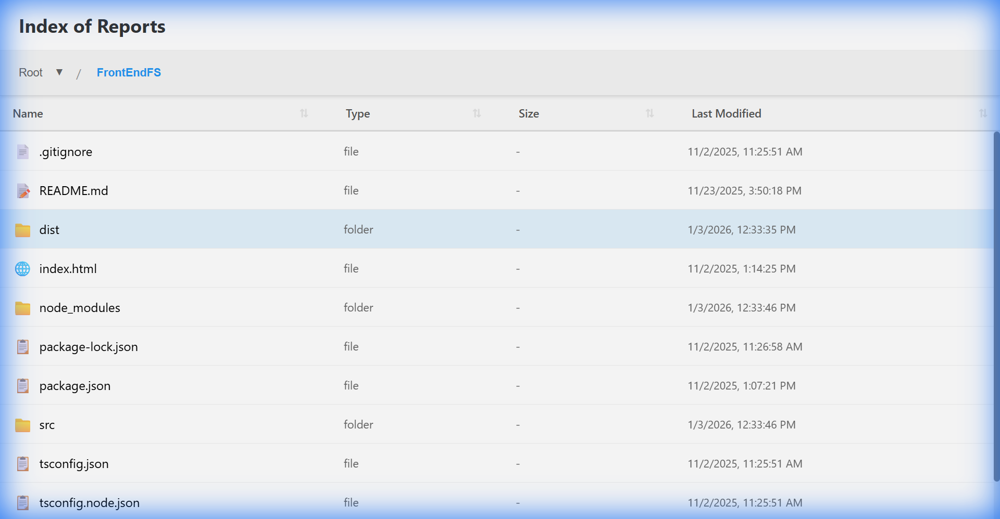

# 📂 FileServer

[](https://golang.org)
[](https://reactjs.org)
[](https://www.typescriptlang.org)
[](https://vitejs.dev)
[](LICENSE)
[](https://Jnaneshd.github.io/FileServer/)

A modern, full-stack file system browser built with **Go** backend and **React TypeScript** frontend. Navigate your file system through an intuitive, responsive web interface.

**🚀 [Try the Live Demo](https://Jnaneshd.github.io/FileServer/)** _(uses mock data)_

---

## 📸 Screenshots

<div align="center">

### Home View

_Browse your file system with a clean, intuitive interface_



### Directory Navigation

_Navigate through folders with breadcrumb trail_



</div>

---

## 📋 Table of Contents

- [Overview](#-overview)
- [Features](#-features)
- [Architecture](#-architecture)
- [Project Structure](#-project-structure)
- [Quick Start](#-quick-start)
- [Backend Setup](#-backend-setup)
- [Frontend Setup](#-frontend-setup)
- [API Reference](#-api-reference)
- [Configuration](#-configuration)
- [Development](#-development)
- [Contributing](#-contributing)

---

## 🔍 Overview

FileServer is a web-based file system explorer that transforms file browsing into a seamless web experience. Perfect for:

- 📁 Browsing local file systems remotely
- 📊 Serving file indexes for reports and documents
- 🔗 Sharing folder structures with team members
- 🖥️ Building internal file management tools

### Tech Stack

| Layer          | Technology            |
| -------------- | --------------------- |
| **Backend**    | Go (standard library) |
| **Frontend**   | React 18 + TypeScript |
| **Build Tool** | Vite 5                |
| **Styling**    | CSS3                  |

---

## ✨ Features

### Core Features

- 🗂️ **Directory Browsing** — Navigate through folders with real-time updates
- 📄 **File Metadata** — View name, type, and last modified timestamp (RFC3339)
- 🧭 **Breadcrumb Navigation** — Easily track and navigate your current location
- ⏪ **Browser History Support** — Use back/forward buttons seamlessly
- 🔗 **URL-Based Navigation** — Bookmark and share specific paths
- 📱 **Responsive Design** — Works perfectly on desktop and mobile

### Technical Features

- ⚡ **CORS Enabled** — Full cross-origin request support
- 🛡️ **Error Handling** — Standardized error models with descriptive messages
- 🔒 **Path Validation** — Security checks for path traversal
- 📂 **Dual Path Support** — Works with both absolute and relative paths
- 🌐 **Smart Routing** — Auto-detects browser vs API requests

---

## 🏗️ Architecture

```
┌─────────────────────────────────────────────────────────────────┐
│                        Client (Browser)                         │
│                     React + TypeScript + Vite                    │
└─────────────────────────────────────────────────────────────────┘
                                │
                                │ HTTP (API calls)
                                ▼
┌─────────────────────────────────────────────────────────────────┐
│                         Go Backend                               │
│  ┌─────────────┐    ┌─────────────┐    ┌─────────────────────┐  │
│  │   Router    │───▶│  Handlers   │───▶│      Services       │  │
│  │ (CORS MW)   │    │             │    │ (File Operations)   │  │
│  └─────────────┘    └─────────────┘    └─────────────────────┘  │
└─────────────────────────────────────────────────────────────────┘
                                │
                                ▼
                    ┌───────────────────┐
                    │   File System     │
                    └───────────────────┘
```

### Request Flow

1. **Browser Request** → Router receives the request
2. **CORS Middleware** → Handles preflight & adds headers
3. **Handler** → Processes request, validates path
4. **Service** → Performs file system operations
5. **Response** → JSON for API calls, redirect for browser navigation

---

## 📁 Project Structure

```
FileServer/
├── 📄 main.go                    # Application entry point
├── 📄 go.mod                     # Go module definition
├── 📄 README.md                  # This file
│
├── 📂 internal/                  # Private application code
│   ├── 📂 handlers/              # HTTP request handlers
│   │   └── FileAPIHandler.go     # File/folder API handlers
│   ├── 📂 router/                # HTTP router setup
│   │   └── filerouter.go         # Routes + CORS middleware
│   ├── 📂 service/               # Business logic
│   │   └── fileservice.go        # File system operations
│   └── 📂 utils/                 # Utility functions
│       └── utils.go              # Error response helpers
│
├── 📂 models/                    # Data models
│   ├── app_error.go              # Custom error types
│   ├── error_models.go           # Error constructors
│   └── models.go                 # File/folder models
│
└── 📂 FrontEndFS/                # React frontend
    ├── 📄 package.json           # NPM dependencies
    ├── 📄 vite.config.ts         # Vite configuration
    ├── 📄 tsconfig.json          # TypeScript config
    ├── 📂 src/
    │   ├── App.tsx               # Main application component
    │   ├── App.css               # Application styles
    │   ├── main.tsx              # React entry point
    │   ├── types.ts              # TypeScript type definitions
    │   ├── 📂 components/        # React components
    │   │   └── ...
    │   └── 📂 services/          # API service layer
    │       └── ...
    └── 📂 dist/                  # Production build output
```

---

## 🚀 Quick Start

### Prerequisites

- **Go** 1.21 or higher
- **Node.js** 18 or higher
- **npm** 9 or higher

### One-Command Setup

```bash
# Clone the repository
git clone https://github.com/Jnaneshd/FileServer.git
cd FileServer

# Terminal 1: Start the backend
go run main.go

# Terminal 2: Start the frontend
cd FrontEndFS
npm install
npm run dev
```

Then open **http://localhost:5173** in your browser!

---

## ⚙️ Backend Setup

### Installation

```bash
# Navigate to project root
cd FileServer

# Download dependencies (if any)
go mod tidy
```

### Running the Server

```bash
# Development
go run main.go

# Build and run
go build -o fileserver
./fileserver
```

The server will start on **http://localhost:8080**

### Environment Variables

| Variable      | Description                        | Default                      |
| ------------- | ---------------------------------- | ---------------------------- |
| `UI_BASE_URL` | Frontend URL for browser redirects | `http://localhost:3000/dist` |

---

## 🎨 Frontend Setup

### Installation

```bash
cd FrontEndFS

# Install dependencies
npm install
```

### Development

```bash
# Start dev server with hot reload
npm run dev
```

Frontend runs on **http://localhost:5173**

### Production Build

```bash
# Create optimized production build
npm run build

# Preview production build
npm run preview
```

---

## 📡 API Reference

### Base URL

```
http://localhost:8080
```

### Endpoints

#### Get Files & Folders

```http
GET /files?path={directory_path}
```

| Parameter | Type     | Description                                        |
| --------- | -------- | -------------------------------------------------- |
| `path`    | `string` | Directory path to list (optional, defaults to CWD) |

**Response:**

```json
[
  {
    "name": "documents",
    "type": "directory",
    "lastModified": "2024-01-15T10:30:00Z"
  },
  {
    "name": "readme.txt",
    "type": "file",
    "lastModified": "2024-01-10T08:15:30Z"
  }
]
```

#### Get Folders Only

```http
GET /folders?path={directory_path}
```

Returns only directories, useful for folder tree navigation.

#### Serve File Content

When requesting a file path, the API automatically serves the file content with proper MIME type.

### Error Responses

All errors follow this format:

```json
{
  "code": 400,
  "message": "Error: The path does not exist",
  "details": "stat /invalid/path: no such file or directory"
}
```

| Code | Description                                    |
| ---- | ---------------------------------------------- |
| 400  | Bad Request (invalid path, missing parameters) |
| 500  | Internal Server Error                          |

---

## 🔧 Configuration

### CORS Configuration

The server allows all origins by default. To restrict:

```go
// In internal/router/filerouter.go
w.Header().Set("Access-Control-Allow-Origin", "https://your-domain.com")
```

### API Base URL (Frontend)

Configure in `FrontEndFS/src/services/api.ts`:

```typescript
const API_BASE = "http://localhost:8080";
```

---

## 💻 Development

### Running Tests

```bash
# Backend tests
go test ./...

# Frontend tests
cd FrontEndFS
npm test
```

### Code Quality

```bash
# Go formatting
go fmt ./...

# Go linting (requires golangci-lint)
golangci-lint run

# TypeScript linting
cd FrontEndFS
npm run lint
```

### Building for Production

```bash
# Build backend
go build -o fileserver -ldflags="-s -w" .

# Build frontend
cd FrontEndFS
npm run build
```

---

## 🤝 Contributing

Contributions are welcome! Please feel free to submit a Pull Request.

1. Fork the repository
2. Create your feature branch (`git checkout -b feature/amazing-feature`)
3. Commit your changes (`git commit -m 'Add amazing feature'`)
4. Push to the branch (`git push origin feature/amazing-feature`)
5. Open a Pull Request

---

## 📄 License

This project is licensed under the MIT License - see the [LICENSE](LICENSE) file for details.

---

## 🙏 Acknowledgments

- Built with ❤️ using Go and React
- Inspired by Apache's directory listing

---

<div align="center">

**[⬆ Back to Top](#-fileserver)**

Made with ☕ by [Jnanesh D](https://github.com/JnaneshD)

</div>
